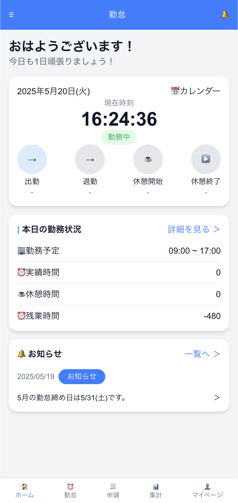

# 勤怠管理アプリ（attendance-app）

出勤・退勤・休憩の打刻ができる、モバイル風の勤怠管理アプリです。Next.js（App Router）と React の学習を兼ねて、1からUIとロジックを実装しました。

## スクリーンショット





##　デモ

[https://attendance-app-rust-gamma.vercel.app](https://attendance-app-rust-gamma.vercel.app)


## 主な機能

- 出勤 / 退勤 / 休憩開始 / 休憩終了 の打刻（タップした瞬間の時刻を記録）
- 未出勤時は退勤・休憩ボタンを押せないなど、状態に応じたボタンの活性/非活性制御
- 現在時刻のリアルタイム表示（1秒ごとに更新）
- 実績時間・休憩時間・残業時間の自動計算
- Tailwind CSSによるモバイルアプリ風のUI
- Supabase Authによるユーザー登録・ログイン機能（未ログイン時は自動でログイン画面にリダイレクト）
- 打刻データはSupabase（PostgreSQL）にユーザーごとに保存され、リロードしても復元される

## 使用技術

- [Next.js](https://nextjs.org/) 16 (App Router / Turbopack)
- [React](https://react.dev/) 19
- TypeScript
- [Tailwind CSS](https://tailwindcss.com/) v4
- [Supabase](https://supabase.com/)（Auth / Database）

## セットアップ

```bash
npm install
npm run dev
```

### 環境変数

Supabaseと連携するため、プロジェクトルートに`.env.local`を作成し、以下を設定してください。

```
NEXT_PUBLIC_SUPABASE_URL=（SupabaseプロジェクトのURL）
NEXT_PUBLIC_SUPABASE_ANON_KEY=（Supabaseのanon publicキー）
```


値はSupabaseダッシュボードの「Project Settings → API」から取得できます。


[http://localhost:3000](http://localhost:3000) をブラウザで開いてください。

## 今後の課題

過去に見つかった不具合・改善点は [Issues](https://github.com/Y-Mato/attendance-app/issues?q=is%3Aissue+is%3Aclosed) で管理し、対応済みです。

今後の展望:
- 各画面の作成

